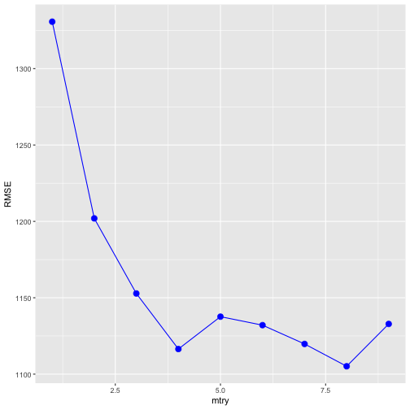

## Motivation

1. Random Forest is a popular algorithm for Machine Learning tasks.
2. Two key parameters are the number of trees to grow (ntrees) and the number of predictors randomdly sampled at each split (mtry).
3. It is important to know how the root mean square error varies as a function of ntrees and the number of cross-validation folds.

--- .class #id 

## Description

1. This app allows you to choose between 5 or 10 cross-validation folds and the number of trees.
2. It fits a Random Forest algorithm to the 'diamonds' dataset, to predict the price of a diamond.
3. The app returns a plot with the variation of the RMSE as a function of mtry.
4. It also reports the best RMSE, the mtry for the best RMSE and a table with the values used in the plot.

---

## Example code

In this example, we choose 100 as the number of trees and 5 as the cross-validation folds.


```r
ntree <- 100
ncv <- 5
```


```r
train_data <- diamonds[runif(200,1,dim(diamonds)[1]),]

max_mtry <- ncol(train_data)-1

tunegrid <- expand.grid(.mtry = c(1:max_mtry))
model <- train(data.frame(train_data[,-7]), train_data$price, 
               method = "rf", 
               metric = "RMSE",
               trControl = trainControl(method="cv", 
                                        number=as.integer(ncv)),
               tuneGrid = tunegrid,
               ntree = ntree)
```

---

## Example plot

The RMSE as a function of mtry is the following.



You can try the app [here](https://smarchi.shinyapps.io/final_project_developing_data_products/)
---
